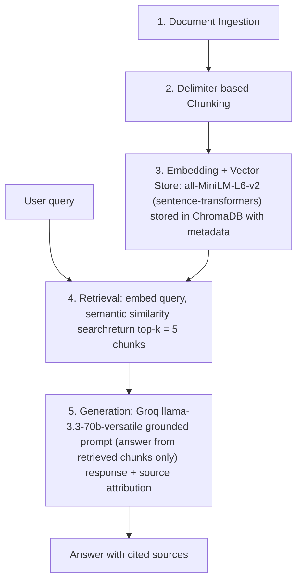

# Project 1 Planning: The Unofficial Guide

> Write this document before you write any pipeline code.
> Your spec and architecture diagram are what you'll use to direct AI tools (Claude, Copilot, etc.) to generate your implementation — the more specific they are, the more useful the generated code will be.
> Update the Retrieval Approach and Chunking Strategy sections if you change your approach during implementation.
> Update this file before starting any stretch features.

---

## Domain

<!-- What domain did you choose? Why is this knowledge valuable and hard to find through official channels? -->

- Domain: Real rate my professor (RMP) reviews from students in NYU Courant's graduate computer science program.

- Why valuable?: You cannot find information below through official channels like - whether the exams of certain courses will be graded on a curve, how many hours of homework you'll have each week, whether TAs are helpful, or how clear the professors' lectures are.

---

## Documents

<!-- List your specific sources: URLs, subreddit names, forum threads, or file descriptions.
     Aim for at least 10 sources that together cover different subtopics or perspectives within your domain. -->

| #   | Source | Description                   | URL or location                                    |
| --- | ------ | ----------------------------- | -------------------------------------------------- |
| 1   | RMP    | Prof Bari's RMP reviews       | https://www.ratemyprofessors.com/professor/2094203 |
| 2   | RMP    | Prof Bethe's RMP reviews      | https://www.ratemyprofessors.com/professor/2733433 |
| 3   | RMP    | Prof Dodis's RMP reviews      | https://www.ratemyprofessors.com/professor/1617817 |
| 4   | RMP    | Prof Franchitti's RMP reviews | https://www.ratemyprofessors.com/professor/1528605 |
| 5   | RMP    | Prof Franke's RMP reviews     | https://www.ratemyprofessors.com/professor/1941851 |
| 6   | RMP    | Prof Plock's RMP reviews      | https://www.ratemyprofessors.com/professor/1776202 |
| 7   | RMP    | Prof Shasha's RMP reviews     | https://www.ratemyprofessors.com/professor/539405  |
| 8   | RMP    | Prof Tang's RMP reviews       | https://www.ratemyprofessors.com/professor/2738155 |
| 9   | RMP    | Prof Yap's RMP reviews        | https://www.ratemyprofessors.com/professor/419998  |
| 10  | RMP    | Prof Zahran's RMP reviews     | https://www.ratemyprofessors.com/professor/1743821 |

**Preprocessing:**
All documents were manually copied from Rate My Professor (RMP) website. Navigation links and ads were removed during manual copying, leaving almost no HTML; Reviews were split into chunks using "---" as a separator, and fields such as Quality / Difficulty / Course / Date were extracted from each review. These fields are retained in the chunk body (for semantic retrieval and LLM use) and are also stored separately in ChromaDB metadata, along with the source filename and chunk
position (to meet attribution requirements and prepare for metadata-based scoring).

---

## Chunking Strategy

<!-- How will you split documents into chunks?
     State your chunk size (in tokens or characters), overlap size, and explain why those
     numbers fit the structure of your documents.
     A review-heavy corpus warrants different chunking than a long FAQ. -->

**Chunk size:**
Use delimiter-based chunking strategy to split documents into chunks. Each chunk represents a review entry which includes review metadata and review texts.

**Overlap:** 0 or None

**Reasoning:**

- I use delimiter-based chunking strategy because in each document, each review entry is explicitly delimited by `---`.

- The overlap is set to 0 because in each document, the delimiter is naturally set to be `---` which means after delimiter-based chunking, each chunk corresponds exactly to a single review entry. If I chunk with overlap, one good review entry might be mixed with its adjacent bad review entry.

**Final chunk count:** ~100–110 (approximate; confirmed after Milestone 3)

---

## Retrieval Approach

<!-- Which embedding model are you using (e.g., all-MiniLM-L6-v2 via sentence-transformers)?
     How many chunks will you retrieve per query (top-k)?
     If you were deploying this for real users and cost wasn't a constraint, what tradeoffs
     would you weigh in choosing a different embedding model — context length, multilingual
     support, accuracy on domain-specific text, latency? -->

**Embedding model:** all-MiniLM-L6-v2 via sentence-transformers. Why is it sufficient? A chunk consists of a single short review entry, which is well below the model’s input limit of approximately 256 tokens and will not be truncated. The model is small, can be run locally, requires no API key or rate limits, and performs robustly on general English semantic similarity tasks. Since the documents consists of general English student comments with no obscure domain-specific text, it is sufficient.

**Top-k:** Initial k=5. The reasoning is most queries take the form of "Professor X has attribute Y," and relevant reviews are typically limited to a few entries. A value of k=5 captures the mainstream sentiment without unduly diluting the results; with only about 110 chunks in the corpus, setting k too high would significantly reduce the signal-to-noise ratio. The final value will be fine-tuned after reviewing the actual search results in Milestone 4.

**Production tradeoff reflection:**

- Multilingual Embedding Model: Since the users are mostly NYU master students which include many international students, a multilingual model is preferred to deal with non-english queries if deployed in future. But the cost is slower inference. Moreover, on purely English tasks, specialized multilingual models sometimes perform worse in terms of single-language accuracy than comparable English-only models (since they allocate computational resources across dozens of languages)

- Domain Accuracy: Since the documents contain terms/jargons in computer science, NYU course codes and some abbreviations like PL, OS, HW, a larger model fine-tuned for academic texts is preferred if deployed in future. The trade-offs are slower performance with higher resource consumption. In addition, models fine-tuned for academic texts may not fully grasp colloquial student reviews (slang, abbreviations, sarcastic tone) found in RMP, as the domains do not fully align.

---

## Evaluation Plan

<!-- List your 5 test questions with their expected correct answers.
     Questions should be specific enough that you can judge whether the system's response
     is right or wrong. "What are good dining halls?" is too vague.
     "What do students say about wait times at [dining hall name] during lunch?" is testable. -->

| #   | Question                                                                                                        | Expected answer |
| --- | --------------------------------------------------------------------------------------------------------------- | --------------- |
| 1   | How do students think about the workload for Prof Dodis's fundamental algorithm course?                         |                 |
| 2   | Why are the reviews of Prof Yap's students so polarized?                                                        |                 |
| 3   | Which professor's course uses a grading curve?                                                                  |                 |
| 4   | What are the main complaints students have about Prof Bethe's class?                                            |                 |
| 5   | If I want to learn operating system, what's the difference between Prof Tang's course and Prof Franke's course? |                 |

---

## Anticipated Challenges

<!-- What could go wrong? Name at least two specific risks with reasoning.
     Consider: noisy or inconsistent documents, missing source attribution, off-topic
     retrieval, chunks that split key information across boundaries. -->

1. Formatting issues in dirty data/documents: for example the metadata of reviews is misspelled or even missing, which may cause field extraction errors during chunking and corrupt the metadata in ChromaDB

2. Uneven retrieval for comparison-based questions: Evaluation Question 5 requires both professors' reviews to rank in the top-k; fixing k=5 may favor one side but ignore the other, resulting in a lopsided comparison.

---

## Architecture

<!-- Draw a diagram of your pipeline showing the five stages:
     Document Ingestion → Chunking → Embedding + Vector Store → Retrieval → Generation
     Label each stage with the tool or library you're using.
     You can use ASCII art, a Mermaid diagram, or embed a sketch as an image.
     You'll use this diagram as context when prompting AI tools to implement each stage. -->

---

## AI Tool Plan

<!-- For each part of the pipeline below, describe:
     - Which AI tool you plan to use (Claude, Copilot, ChatGPT, etc.)
     - What you'll give it as input (which sections of this planning.md, which requirements)
     - What you expect it to produce
     - How you'll verify the output matches your spec

     "I'll use AI to help me code" is not a plan.
     "I'll give Claude my Chunking Strategy section and ask it to implement chunk_text()
     with my specified chunk size and overlap" is a plan. -->

**Milestone 3 — Ingestion and chunking:**

- AI tool I plan to use: Claude
- Input: Domain, Documents, Chunking Strategy and Architecture sections in planning.md
- Expected output
  - load_documents() which helps load and process review documents from documents folder;
  - chunk_text() which uses specific chunking strategy in planning.md;
  - metadata of each chunk which includes source file name, position and quality/course/date
- How to verify if output matches spec:
  - print 5 random chunks to see if each one is readable, substantive and self-contained;
  - count total number of chunks;
  - check the metadata of random chunks to see if it's correctly extracted from documents

**Milestone 4 — Embedding and retrieval:**

- AI tool: Claude
- Input: Retrieval Approach and Architecture sections in planning.md
- Expected Output
  - embed_and_store() which embeds each chunk and stores them into ChromaDB along with metadata
  - retrieval(query, k) which returns top-k chunks with their sources and distances
- How to verify: use 5 evaluation questions to print chunks with distances. Then see if they're related and if distances < 0.5

**Milestone 5 — Generation and interface:**

- AI tool: Claude
- Input:
  - grounding requirement (answers from retrieved context only, with source attribution)
  - the output format (answer + source list)
  - Architecture section in planning.md
  - the Gradio skeleton structure
- Expected output:
  - a system prompt which enforces grounding, not just suggests it
  - ask(query) which returns answer with sources
  - a Gradio interface
- How to verify:
  - write grounding test to see if answers are traceable to retrieved text and if source is cited
  - ask questions which documents don't cover to see if the system explicitly says it doesn't have enough information

## Stretch Feature: Metadata Filtering

**Purpose:** Filter search results by the "professor" metadata field so that queries about a specific professor are limited to reviews written by that professor.

**Reason:** The retrieval test for Milestone 4 revealed an issue of "cross-contamination" among professors teaching the same course. For example, for Q1, which asked about Dodis, four of the top five results were for Yap (both teach CSCIGA1170), while for Q4, which asked about Bethe, none of the top five results were for Bethe. Since pure semantic retrieval ranks results based on content similarity and ignores the professor's identity, queries about a single professor are often overshadowed by reviews from other professors on the same topic using similar wording.

**How To Do:** Check whether the query contains the last name or full name of any known professors (use string match here because it doesn't require API call and is more controllable than using LLM to extract professors' names). If one or more professors match, use ChromaDB's `where` to filter (use `$in` for multiple professors), and perform semantic search only within the chunks associated with those professors. If no professor names match (e.g., Q3), revert to a full-database semantic search.

**Expected Affected Queries:** Q1 and Q4 are expected to be fixed; Filtering using `$in` can deal with Q5 by focusing on Tang and Franke at the same time; Q3 does not specify any professors, so the full-database search will remain unaffected.
